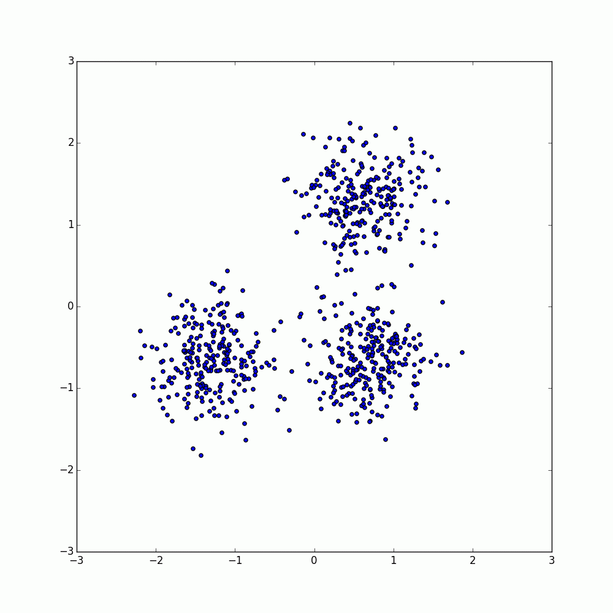

# pyParDis DBSCAN

## 1 Summary

There are currently very few unsupervised machine learning algorithms available for use with large data set.
Of the ones provided natively by Spark (as of 1.5.2 these include k-means, Gaussian mixture, LDA, and power iteration clustering), none of which work well for anomaly detection where anomalies are rare and have little spatial structure.

pyParDis DBSCAN is meant to fill this gap by implementing DBSCAN (Density Based Spatial Clustering Application with Noise) in a parallel and distributed manner on Spark.
While there are other parallelized implementations of DBSCAN (most notably by [Irving Cordova](https://github.com/irvingc/dbscan-on-spark) and [Mostofa Patwary](http://cucis.ece.northwestern.edu/projects/Clustering/index.html)), these methods are limited.
In particular, Cordova's algorithm only works in two dimensions and Patwary's requires the input data to be written to files in a very restrictive format.
pyParDis DBSCAN was developed to overcome these limitations.

## 2 Algorithm

pyParDis [DBSCAN](dbscan.py) begins by partitioning the given Spark Resilient Distributed Dataset (RDD) into approximately equal sized pieces using the k-dimensional partitioner [KDPartitioner](partition.py).

By default, the KDPartitioner attempts to split the data into nearly equal sized sets by splitting the data along the axis with the greatest variance and approximating the median along that axis by assuming the median is close to the mean (within +/- 0.9 standard deviations).
This process is repeated on the subsequent partitions until the desired number of partitions (`max_partitions`) has been achieved and the corresponding dictionary of bounding boxes ([BoundingBox](geometry.py) objects contains vectors specifying the upper and lower bounds of each partition after splitting) is stored.

These bounding boxes are then expanded by twice the DBSCAN radius (`eps`) and used to create a set of neighborhoods each containing the points within the corresponding bounding box and the label of that bounding box.
Note that this expansion method only works if the metric is Euclidean, Manhattan, or a similar metric as other metrics could find points within `eps` that are outside of these boxes.
These neighborhoods are then merged back together (resulting in the duplication of points within the overlaps of the enlarged bounding boxes) and the resulting RDD is repartitioned using the neighborhood ID.

Within each of these partitions, a DBSCAN is performed using the [sklearn DBSCAN](http://scikit-learn.org/stable/modules/generated/sklearn.cluster.DBSCAN.html) algorithm.
The points are then labeled with the partition ID, the cluster ID, and whether or not that point is a core point as found by  the sklearn DBSCAN and yielded to the RDD.

Next, these labeled points are grouped by their index with their cluster IDs merged and a mapping between partition level clustering IDs to global IDs is made.
DBSCAN is a greedy algorithm, so non-core points can be assigned to any cluster from which they can be reached. Thus, if a non-core point is reachable from multiple clusters, it can be assigned to any of those clusters.
Such labellings must be ignored otherwise clusters could improperly merge when combining the cluster IDs.

Finally, the labeled points are then mapped onto their global cluster IDs.
For points with multiple labels, only the first label is used.
With core points, the choice of label with be inconsequential, however non-core points will be randomly assigned to a cluster.

#### Animated example of pyParDis DBSCAN

## 3 Usage

### Examples

Examples base on the [DBSCAN demo](http://scikit-learn.org/stable/auto_examples/cluster/plot_dbscan.html) from scikit-learn are provided within `dbscan.py` and `partition.py` and can be run from a terminal without any arguments.

### Requirements

This project was developed using the following packages. Earlier versions may not work.
* python - 2.7.10
* pyspark - 1.5.2
* sklearn - 0.16.0
* scipy - 0.14.1
* numpy - 1.9.2

### Optional requirements

Required to run examples and make the included plots.
* matplotlib - 1.4.3

## 4 Future developments

While the algorithm scales well (preliminary benchmarks indicate O(n)), it requires that all indices and cluster IDs be loaded in memory when merging the cluster IDs. Work is continuing on implementing this in a distributed way.
